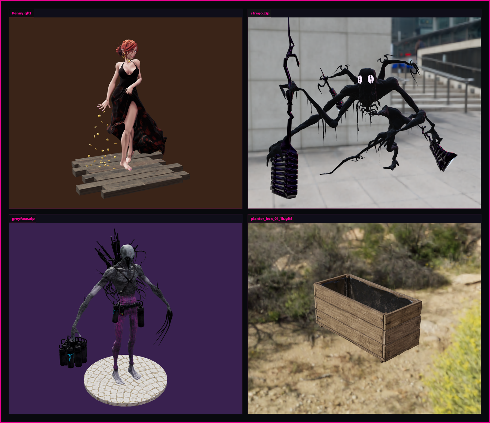

# 3D Viewer



I made this quickly because I wanted a fast way to inspect 3D assets without opening Blender, Unity, or a heavier viewer. Drop in a `.glb`, `.gltf`, `.fbx`, or zipped model bundle, look around, check the texture/material read, and move on.

It is a small Python desktop app that wraps a local Three.js viewer in PySide6 QtWebEngine. The app opens a frameless always-on-top window, serves the selected model from a temporary local runtime folder, and remembers its window position between launches.

## Purpose

- Open common 3D asset files fast.
- Inspect model shape, texture, lighting, scale, and framing.
- Avoid loading a full DCC app just to check one file.
- Keep the app local, lightweight, and easy to modify.

## Main features

- Loads `.glb`, `.gltf`, `.fbx`, and `.zip` files.
- Supports nested Sketchfab-style ZIP downloads.
- Bundles a small offline sample model so the repo works immediately.
- Uses vendored Three.js files, so the viewer code does not need a web CDN.
- Optional Poly Haven HDRIs download on first launch if internet is available.
- Falls back cleanly to flat lighting if HDRIs are unavailable.
- Saves window position and size.
- Includes a Windows Explorer right-click installer.

## Quick start

```bash
python -m pip install -r requirements.txt
python viewer.py
```

Running with no model opens the bundled sample:

```bash
python viewer.py samples/planter_box_01/planter_box_01_1k.gltf
```

## Controls

- Left mouse: orbit
- Middle mouse drag: smooth zoom
- Mouse wheel: zoom
- Right mouse: pan
- `F`: frame model and cycle through saved angles
- `A`: auto-rotate
- `W`: wireframe
- `X`: wireframe x-ray
- `C`: clay material
- `H`: HDRI slot
- `Ctrl+B`: show or hide HDRI background
- `L`: lighting mode
- `B`: flat background color
- `D`: diagnostics overlay
- `Q`: quality mode
- `T`: always-on-top
- `P`: pause WebGL
- `I`: write a process snapshot to the log
- `Ctrl+O`: open another model in the same window
- `O`: open the model folder
- `Esc`: close

## Windows right-click menu

Install the Explorer entry for `.glb`, `.gltf`, `.fbx`, and `.zip` files:

```bash
python scripts/install_context_menu.py
```

Remove it:

```bash
python scripts/install_context_menu.py --remove
```

## How it works

The Python launcher normalizes the input model into `runtime/`, starts a local HTTP server, and opens a QtWebEngine window. The embedded page uses Three.js loaders for glTF, GLB, FBX, and extracted ZIP contents.

HDRIs are not committed to the repo. On launch, the viewer checks `runtime/hdri_cache/`; if the HDRIs are missing and the machine is online, it downloads the configured 2k Poly Haven files. If that fails, the viewer still opens with normal lights.

Runtime folders, logs, copied model bundles, downloaded HDRIs, and extracted ZIPs are ignored by git.

## Notes

This is meant to be a fast inspection tool, not a full editor. It will not replace Blender, Unity, Substance, or a real model cleanup pipeline. It is just a quick local window for checking whether a model is worth keeping, adjusting, or importing somewhere else.
