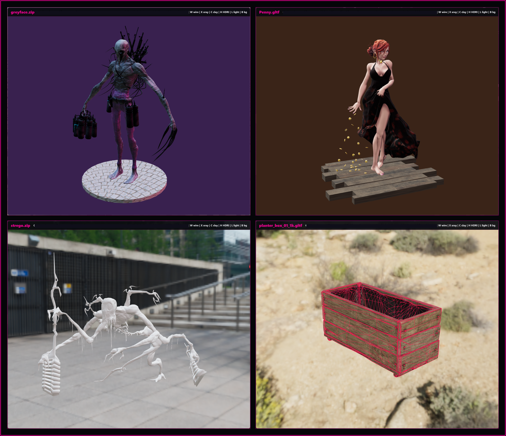

# 3D Viewer

I made this quickly because I wanted a faster way to look at 3D assets without opening Blender, Unity or another heavier tool every time. You can open a model, move around it, and check the lighting, textures, topology, wireframe or clay view, etc.

It opens `.glb`, `.gltf`, `.fbx`, and `.zip` files, including zipped glTF or GLB models. Root motion can be turned off for animated models, animation files with only bones show a simple skeleton, and you can group model variants with a small `viewer_variants.json` file next to the model to compare them. There's a sample model included, and the Poly Haven HDRIs are optional.

It's a small Python app using PySide6, with the Three.js viewer running in a QtWebEngine view.

## Quick start

```bash
python -m pip install -r requirements.txt
python viewer.py
```

With no model it opens the sample. You can also pass a model path, or `--last` to reopen the last one:

```bash
python viewer.py path/to/model.glb
python viewer.py --last
```

## Controls

- Left mouse: orbit
- Middle mouse drag: smooth zoom
- Mouse wheel: zoom
- Right mouse: pan
- `F`: frame model and cycle through saved angles
- `Space`: play or pause embedded animation clips
- `[` / `]`: previous or next animation clip
- `0`: restart current animation clip
- `R`: toggle root motion
- `M`: swap model variants
- `+` / `-`: animation speed
- `A`: auto-rotate
- `W`: wireframe
- `X`: wireframe x-ray
- `C`: clay material
- `H`: HDRI slot
- `Ctrl+B`: show or hide HDRI background
- `L`: lighting mode
- `B`: flat background color
- `D`: diagnostics overlay
- `Q`: quality mode
- `T`: always-on-top
- `P`: pause rendering
- `I`: write a process snapshot to the log
- `Ctrl+O`: open another model in the same window
- `O`: open the model folder
- `Esc`: close

## Windows right-click menu

Install the Explorer entry for `.glb`, `.gltf`, `.fbx`, and `.zip` files:

```bash
python scripts/install_context_menu.py
```

Remove it:

```bash
python scripts/install_context_menu.py --remove
```
